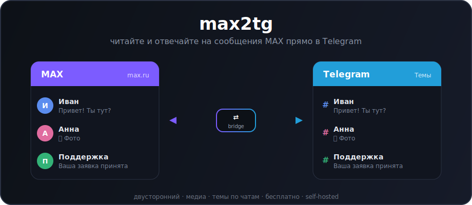
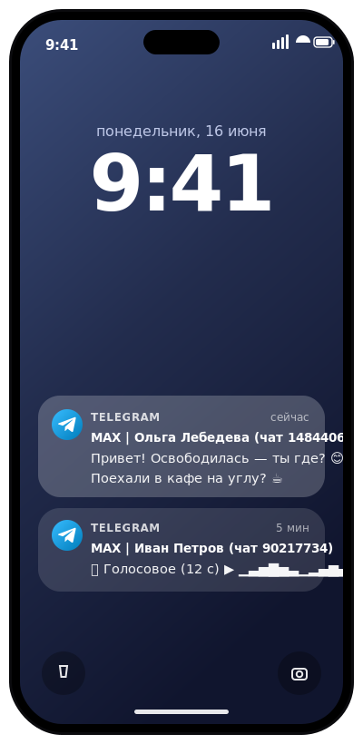
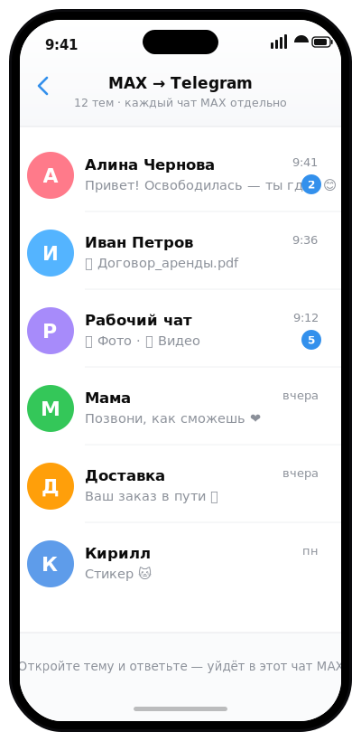
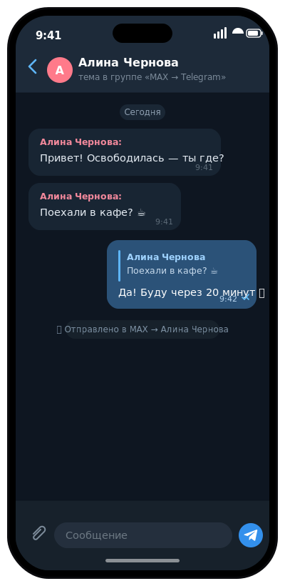

# MAX → Telegram 🚀

<p align="center">
  
</p>

<p align="center">
  <a href="https://github.com/NeuralGoose/max2tg/actions/workflows/ci-docker.yml"></a>
  <a href="https://github.com/NeuralGoose/max2tg/pkgs/container/max2tg"></a>
  <a href="LICENSE"></a>
  
</p>

<p align="center">
  <b>Читайте и отвечайте на сообщения мессенджера MAX (max.ru) прямо в Telegram.</b><br>
  Двусторонний · медиа · отдельная тема на каждый чат · бесплатно · self-hosted
  &nbsp;·&nbsp; 🇬🇧 <a href="#-in-english">In English</a>
</p>

<p align="center">
  <sub>🍴 Форк <a href="https://github.com/Sillkiin/max2tg">Sillkiin/max2tg</a> с расширенной авторизацией (<b>QR / SMS — без вставки токена</b>) и упором на надёжность. <a href="#-чем-отличается-этот-форк">Что добавлено →</a></sub>
</p>

---

`max2tg` — личный мост: зеркалит ваш аккаунт **MAX** в **Telegram**. Входящие
сообщения, фото, видео, файлы и стикеры прилетают в Telegram, а ответить можно
прямо оттуда — ответ уходит в нужный чат MAX.

> ##  Для пользователей iPhone / iPad
>
> **MAX удалён из App Store** — на iOS его официально не установить, и нормально
> пользоваться MAX на Apple сейчас по сути невозможно. **`max2tg` это решает:**
> все ваши диалоги MAX приходят в **Telegram**, который у вас уже есть, —
> **с обычными push-уведомлениями** 🔔, поиском и нормальным клиентом. Отвечать
> тоже можно прямо из Telegram. По факту это **единственный рабочий способ**
> читать и писать в MAX с iPhone.

<p align="center">
  
  &nbsp;
  
  &nbsp;
  
</p>
<p align="center">
  <sub><b>1.</b> пуши из MAX на локскрине iPhone&nbsp;·&nbsp;<b>2.</b> каждый чат — отдельная тема&nbsp;·&nbsp;<b>3.</b> ответ из Telegram уходит обратно в MAX&nbsp;&nbsp;<i>(макеты)</i></sub>
</p>
<p align="center">
  <sub>Видно, что сообщения именно из MAX: мост помечает каждое — <code>MAX | Имя (чат …)</code>, голосовые и видео-кружки приходят как обычные проигрываемые сообщения Telegram, а доставку ответа подтверждает <code>✅ Отправлено в MAX</code>. Это реальный формат вывода моста.</sub>
</p>

## Содержание

- [🍴 Чем отличается этот форк](#-чем-отличается-этот-форк)
- [Возможности](#возможности)
- [Быстрый старт](#быстрый-старт)
- [🔑 Аутентификация (вход в MAX)](#-аутентификация-вход-в-max)
- [⭐ Режим тем](#-режим-тем)
- [🎮 Команды](#-команды)
- [Запуск на сервере 24/7](#запуск-на-сервере-247)
- [Вопросы и ответы](#вопросы-и-ответы)
- [Ограничения](#ограничения)
- [Для разработчиков](#для-разработчиков)

---

## 🍴 Чем отличается этот форк

Это форк [Sillkiin/max2tg](https://github.com/Sillkiin/max2tg). Оригинал работал
через библиотеку `vkmax` и **только по вставленному web-токену**. Этот форк
переписан на поддерживаемый клиент **PyMax** (`maxapi-python`) и добавляет:

- 🔑 **Вход без токена — QR или SMS.** Больше не нужно лезть в консоль браузера:
  отсканируйте QR прямо из приложения MAX **или** войдите по номеру телефона и
  коду из SMS. Старый вход по токену тоже остался. Подробно —
  [Аутентификация](#-аутентификация-вход-в-max).
- 🤖 **Интерактивный вход через самого бота.** QR-картинка, код из SMS и пароль
  двухфакторки запрашиваются и принимаются прямо в чате с ботом в Telegram —
  идеально для headless-сервера (`maxauth.py`).
- 🚦 **Устойчивость к лимитам Telegram.** Учёт `429 Too Many Requests`,
  межзапросный пейсинг и отдельный (более мягкий) пейсинг во время предзагрузки.
- 🗂 **Умная предзагрузка тем.** Создание тем и подсев последних сообщений в
  правильном хронологическом порядке, с дедупом и исключением служебных чатов.
- 🎤 **Голосовые и видео-кружки.** Приходят в Telegram как обычные проигрываемые
  сообщения, а не как «открыть в MAX»: надёжный резолв медиа, включая обход бага
  парсинга кружков в библиотеке (`mediamax.py`).
- 🛡 **Надёжность.** Атомарная запись `config.json` / `state.json`, восстановление
  после повреждённого `state.json`, дедуп без тем (для fallback-режима), повтор
  при частичной доставке, пересоздание «протухших» тем, команды форума только для
  владельца, защита загрузки медиа.
- 🧪 **Тесты и CI.** Набор тестов в Docker-харнессе, совпадающий с CI (pytest).

> Спасибо автору оригинала — [Sillkiin/max2tg](https://github.com/Sillkiin/max2tg).

---

## Возможности

| | |
|---|---|
|  **Работает на iOS** | MAX удалён из App Store — а здесь все диалоги приходят в Telegram, который на iPhone есть всегда |
| 🔔 **Уведомления** | Пуши о новых сообщениях MAX приходят как обычные уведомления Telegram — на iOS это единственный способ их получать |
| ↔️ **Двусторонний** | Не просто пересылка — отвечаете **из Telegram**, и сообщение уходит в чат MAX |
| 🗂 **Темы** | Каждый MAX-чат = отдельная тема Telegram-форума с именем собеседника |
| 🎮 **Команды** | Вступать в каналы и искать людей прямо из Telegram — `/join`, `/find` |
| 🖼 **Медиа** | Фото, видео, файлы, стикеры — в обе стороны; голосовые и видео-кружки из MAX проигрываются прямо в Telegram |
| 🔒 **Приватно** | Токены и переписка остаются у вас; ничего не уходит на чужие серверы |
| 🆓 **Бесплатно** | Без подписок, открытый код (MIT) |
| 🖥 **Где угодно** | Windows, старый Android (Termux) или сервер 24/7 |

**Что именно передаётся:**

| Направление | Содержимое |
|---|---|
| **MAX → Telegram** | текст, фото, видео, видео-кружки, голосовые, файлы, стикеры |
| **Telegram → MAX** | текст (ответом), фото, видео, файлы |

---

## Быстрый старт

**Windows, ~5 минут.** Запустите **`run.bat`** — мастер настройки попросит:

**1. Токен Telegram-бота**
Создайте бота у [@BotFather](https://t.me/BotFather) командой `/newbot` и
скопируйте выданный токен.

**2. `/start` вашему боту**
Напишите боту `/start`, чтобы мост узнал, куда слать сообщения.

**3. Вход в MAX**
Проще всего — **по QR, без всякого токена**: задайте `MAX2TG_AUTH_METHOD=qr`, и
бот пришлёт QR прямо в Telegram — отсканируете его в приложении MAX. Доступны
также вход по **SMS** (тоже без токена) и классический **web-токен**. Все три
способа и их отличия — в разделе
[🔑 Аутентификация](#-аутентификация-вход-в-max).

> 💡 Если хотите по старинке — вставьте web-токен MAX (мастер примет его). Но
> учтите: тогда **не нажимайте «Выйти» (Logout)** в web.max.ru — это аннулирует
> токен. QR и SMS этого ограничения лишены.

Готово ✅ Мост запущен. Для нормальной работы **обязательно** включите
[режим тем](#-режим-тем) — без него все MAX-чаты сваливаются в одну ленту, а
ответы возможны только через Reply.

> **Устаревший режим без тем** (все сообщения в одну личку с ботом) не
> предназначен для ежедневного использования с несколькими чатами. Он остаётся
> только как аварийный запасной путь, если не удалось создать тему в форуме
> (см. логи: проверьте права бота «Управление темами»).

---

## 🔑 Аутентификация (вход в MAX)

Мост умеет входить в MAX тремя способами. Выбор задаётся одним параметром
`MAX2TG_AUTH_METHOD` (или ключом `max_auth_method` в `config.json`). Все
интерактивные шаги (QR, код из SMS, пароль 2FA) приходят **прямо в чат с ботом**
в Telegram — поэтому годится и для headless-сервера.

| Способ | Нужен токен? | Что вводите | Как выглядит в «Устройствах» MAX |
|---|---|---|---|
| **QR** (рекомендуется) | ❌ нет | сканируете QR в приложении MAX | веб-сессия (**Chrome**) |
| **SMS** | ❌ нет | телефон + код из SMS (+ пароль 2FA) | телефон Android (напр. **Pixel 8, Android 14**) |
| **Token** (как в оригинале) | ✅ да | вставляете web-токен | веб-сессия |

> 💡 Сессия сохраняется в SQLite (`MAX2TG_WORK_DIR`, в Docker — том `/data`),
> поэтому вход нужен **один раз** — после перезапуска повторная авторизация не
> требуется. Полный список переменных — в [`.env.example`](.env.example).

### QR — вход сканированием *(без токена)*

```env
MAX2TG_AUTH_METHOD=qr
```

При первом запуске бот пришлёт вам **QR-картинку и ссылку**. В приложении MAX
откройте **Настройки → Устройства → Подключить устройство** и отсканируйте QR
(или откройте ссылку). Если включена двухфакторная защита, бот попросит **пароль
2FA** ответом в том же чате. Готово — мост сохранит сессию.

> В списке подключённых устройств MAX такой вход отображается как **веб-сессия
> (Chrome)** — потому что QR-клиент работает по веб-протоколу MAX.

### SMS — вход по телефону *(без токена)*

```env
MAX2TG_AUTH_METHOD=sms
MAX2TG_MAX_PHONE=+79991234567
```

Бот пришлёт запрос — ответьте **кодом из SMS** (а если включена двухфакторка —
ещё и **паролем 2FA**) прямо в чате. В отличие от QR, это мобильный клиент,
поэтому в «Устройствах» MAX он виден как **телефон Android** (модель выбирается
из правдоподобного набора, например **Pixel 8, Android 14**).

### Token — вставка web-токена *(совместимость с оригиналом)*

```env
MAX2TG_AUTH_METHOD=token
MAX2TG_MAX_TOKEN=ваш-токен
```

Войдите на [web.max.ru](https://web.max.ru), нажмите `F12` → вкладка **Console**,
выполните команду и вставьте результат:

```js
copy(JSON.parse(localStorage.__oneme_auth).token)
```

> ⚠️ **Не нажимайте «Выйти» (Logout)** в web.max.ru — это аннулирует токен.
> Просто закройте вкладку. Отображается как веб-сессия.

---

## ⭐ Режим тем *(обязателен для работы)*

Чтобы каждый MAX-чат стал **отдельной темой** Telegram-форума:

1. Создайте **Telegram-супергруппу** и включите в настройках **«Темы» (Topics)**.
2. **Добавьте бота в группу**, дайте права **администратора** с разрешением
   **«Управление темами» (Manage Topics)** — без этого мост не создаст темы.
3. Узнайте **id группы** (начинается с `-100…`, например через
   [@getidsbot](https://t.me/getidsbot)) и пропишите в `config.json`:

```json
{
  "telegram_topics_enabled": true,
  "telegram_forum_chat_id": -1001234567890,
  "telegram_preload_topics": true,
  "telegram_seed_last_messages": true,
  "telegram_confirm_sent": false
}
```

Каждый MAX-чат получит свою тему с именем собеседника. Пишете в теме — уходит в
этот чат MAX; **Reply** (свайп) отправляет ответ цитатой.

Если создание темы не удаётся, сообщения временно попадают в `telegram_fallback_chat_id`
(по умолчанию — личка с ботом) с заголовком `MAX | … (чат id)`; ответ — только
через Reply. Исправьте права бота и перезапустите мост.

---

## 🎮 Команды

Ботом можно **управлять MAX прямо из Telegram** — команды видны в меню по «/»:

| Команда | Что делает |
|---|---|
| `/join <ссылка или @username>` | Вступить в **канал / группу / чат** MAX. Новый чат сам станет отдельной темой. |
| `/find <+телефон \| @ник \| ссылка \| id>` | Найти человека или канал и узнать его **id**. |
| `/dm <id> <текст>` | **Написать новому человеку** по его `id` (из `/find`). MAX создаст диалог; ответ придёт отдельной темой. |
| `/help` · `/start` | Справка и приветствие. |

> 💡 **Проще без команд:** пришлите боту **ссылку** `max.ru/join/…` — он сам вступит; **телефон** или **@ник** — найдёт. Команды `/join` / `/find` остаются для привычки.

Примеры:

```
/join https://max.ru/join/AbCdEf   # вступить в канал/чат по ссылке
/find https://max.ru/join/AbCdEf   # что за канал/чат по ссылке — без вступления
/find @ivan                        # найти человека по нику → узнать id
/find +79991234567                 # найти человека по телефону → узнать id
```

> ℹ️ **Написать в существующий чат** — сделайте `Reply` (свайп) на пересланном
> сообщении: уйдёт точно в нужный чат MAX.
>
> **Написать новому человеку:** найдите его через `/find` (получите `id`), затем
> `/dm <id> <текст>`. MAX открывает диалог по `userId` (не по chatId) и сам создаёт
> чат — дальше переписка идёт отдельной темой.

---

## Запуск на сервере 24/7

Мост держит постоянное соединение, поэтому ему нужен хост, который **не
«засыпает»** (обычные бесплатные «спящие» PaaS не подойдут).

| Где | Как |
|---|---|
| 🖥 **Windows** | `run.bat` + автозапуск через `shell:startup` |
| 📟 **Старый Android** | [Termux](https://f-droid.org/packages/com.termux/) — мини-сервер с российским IP |
| ☁️ **Сервер (Docker)** | готовый образ из GHCR, без исходников ↓ |

**Готовый Docker-образ — нужны только два файла:**

```bash
mkdir max2tg && cd max2tg
curl -O https://raw.githubusercontent.com/NeuralGoose/max2tg/main/docker-compose.yml
curl -o .env https://raw.githubusercontent.com/NeuralGoose/max2tg/main/.env.example
nano .env                 # заполните MAX2TG_* (см. комментарии в .env.example; способ входа QR/SMS/token!)
docker compose up -d      # подтянет ghcr.io/neuralgoose/max2tg:latest
```

Обновление позже: `docker compose pull && docker compose up -d`.
Полный гайд (Oracle Cloud, прокси, systemd) — в **[DEPLOY.md](DEPLOY.md)**.

---

## Вопросы и ответы

<details>
<summary><b>Канал шлёт слишком много уведомлений — как заглушить?</b></summary>

<br>Заглушите <b>тему</b> штатными средствами Telegram: долгий тап по теме в
списке → <b>«Выключить уведомления»</b> (или внутри темы → тап по названию →
отключить уведомления). В форуме глушится <b>каждая тема отдельно</b> — каналам
выключите, людям оставите. Это полностью убирает уведомление (и звук, и баннер).
Бот сам сделать это не может: «без звука» он отправить умеет, но совсем убрать
пуш — настройка на стороне Telegram, которую ставите вы.
</details>

<details>
<summary><b>Темы пересоздаются после каждого перезапуска</b></summary>

<br>Значит не сохраняется `state.json` (карта «MAX-чат → тема»). В Docker он лежит
на постоянном томе (`docker-compose.yml`); путь можно задать через
`MAX2TG_STATE_PATH`. Без Docker файл хранится рядом со скриптами.
</details>

<details>
<summary><b>Как убрать «✅ Отправлено в MAX» после каждого ответа</b></summary>

<br>Добавьте в `config.json`: <code>"telegram_confirm_sent": false</code> (или
переменную окружения <code>MAX2TG_TELEGRAM_CONFIRM_SENT=false</code>). Ошибки
отправки при этом всё равно показываются.
</details>

<details>
<summary><b>Мост пишет, что токен MAX устарел</b></summary>

<br>Получите свежий токен на <a href="https://web.max.ru">web.max.ru</a> (та же
команда в консоли) и обновите его в <code>config.json</code> или в
<code>.env</code>, затем перезапустите мост.
</details>

---

## Ограничения

- ⚙️ **Неофициальный API MAX** (через библиотеку **PyMax** / `maxapi-python` —
  официального API для личных аккаунтов нет). Для MAX это выглядит как вход через
  веб-версию; теоретически он может ограничить сессию.
- 🎤 **Голосовые и видео-кружки из MAX** проигрываются прямо в Telegram. Текстовая
  пометка «открыть в MAX» остаётся только как запасной вариант — если MAX не отдал
  ссылку на файл или он больше лимита Telegram (см. ниже).
- 📦 **Файлы и видео до ~50 МБ** (лимит Telegram-ботов); крупнее — уведомление
  «открыть в MAX».
- 🔑 **Токены** лежат локально в `config.json` (в `.gitignore`, не коммитятся).

---

## Для разработчиков

<details>
<summary>Структура проекта и сборка</summary>

<br>

| Файл | Назначение |
|------|------------|
| `main.py` / `setup_wizard.py` | точка входа и мастер настройки |
| `bridge.py` | ядро: слушает MAX, маршрутизирует, принимает ответы |
| `max_client.py` / `maxauth.py` | фабрика клиента **PyMax** (token/sms/qr) и Telegram-вход |
| `attaches.py` / `mediamax.py` | разбор и загрузка медиа MAX |
| `tg.py` | мини-клиент Telegram Bot API |
| `state.py` / `config.py` | карта тем и конфигурация |
| `Dockerfile` / `docker-compose*.yml` / `DEPLOY.md` | деплой |

Тесты гоняются в Docker-харнессе (совпадает с CI):

```bash
docker compose -f docker-compose.test.yml run --rm --build tests   # pytest, -m "not integration"
```

CI (GitHub Actions) на каждый push в `main` гоняет тесты (pytest) и публикует
Docker-образ `ghcr.io/neuralgoose/max2tg:latest`. Для локальной сборки из исходников:
`docker compose -f docker-compose.build.yml up -d --build`.

**Все параметры конфигурации** (темы, форум, исключения чатов, пейсинг API,
глубина и источник предзагрузки, метод входа `token`/`sms`/`qr`, путь к SQLite-сессии
на томе `/data`) задаются через `config.json` или переменные `MAX2TG_*` —
полный список с комментариями в **[`.env.example`](.env.example)**.
</details>

---

## 🇬🇧 In English

<details>
<summary>Click to expand</summary>

<br>**max2tg** mirrors your personal **MAX** (max.ru) messenger account into
**Telegram** and lets you reply from there.

> 🍴 This is a fork of [Sillkiin/max2tg](https://github.com/Sillkiin/max2tg),
> rebuilt on the maintained **PyMax** client. It adds **token-free login via QR or
> SMS** (the original was web-token only), interactive auth prompts delivered in
> the Telegram bot chat, 429-aware rate limiting, smart topic preload, **playable
> voice notes and video circles** (reliable media resolve, incl. a workaround for
> a circle-parsing bug), and a range of robustness fixes (atomic config/state
> writes, corrupt-state recovery, partial-delivery retry, stale-topic recreate,
> owner-only forum commands).

>  **MAX is gone from the App Store** — you can't install it on iPhone/iPad
> anymore. max2tg brings every MAX chat into **Telegram** (which you already
> have) **with normal push notifications** — effectively the only way to use MAX
> on iOS.

- **Two-way.** Incoming MAX messages — text, photos, videos, video notes
  (circles), voice notes, files, stickers — are forwarded to Telegram; reply right
  from Telegram and it lands in the MAX chat.
- **Topics (required).** Each MAX chat becomes its own Telegram forum topic, named
  after the contact. Running without a forum is legacy/fallback only (single
  interleaved chat; replies via Reply only).
- **Commands** (shown in the "/" menu): `/join <link | @username>` — join a MAX
  channel/group/chat · `/find <phone | @username | link | id>` — look up a person or
  channel and get their id · `/help` — command reference.
- **Private & free.** Tokens and messages stay on your machine. Open-source (MIT).
- **Runs anywhere.** Windows, old Android (Termux), or a 24/7 server. Pull the
  ready image: `docker pull ghcr.io/neuralgoose/max2tg:latest`.

**Login methods** (set `MAX2TG_AUTH_METHOD`):

- **QR (recommended, no token).** The bot posts a QR image in your Telegram chat;
  scan it in the MAX app (Settings → Devices → Link device). Shows up in MAX's
  connected devices as a **web "Chrome"** session.
- **SMS (no token).** Set `MAX2TG_MAX_PHONE`; reply with the SMS code (and 2FA
  password if enabled) in the chat. Shows up as a **mobile Android device**
  (e.g. Pixel 8 / Android 14).
- **Token (legacy).** Paste your MAX web token from
  [web.max.ru](https://web.max.ru) (DevTools console:
  `copy(JSON.parse(localStorage.__oneme_auth).token)`).

**Quick start:** run `run.bat`, create a bot via [@BotFather](https://t.me/BotFather),
then pick a login method above — QR needs no token at all.

> ⚠️ With the **token** method, don't press **Logout** in web.max.ru — it
> invalidates the token (QR/SMS don't have this caveat). Uses MAX's **unofficial**
> API. Voice notes and video circles from MAX are forwarded as playable Telegram
> media; a text "open in MAX" note is only a fallback when MAX returns no URL or
> the file is over Telegram's ~50 MB limit. Use at your own risk.
</details>

---

## Дисклеймер

Личный инструмент для удобства, не связан с MAX/VK и Telegram. Использует
неофициальный API — применяйте на свой риск и соблюдайте условия сервисов.
**Лицензия: [MIT](LICENSE).**
